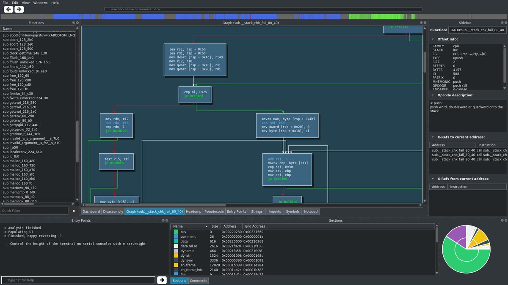

.. _cutter:

Cutter
======

.. image:: _static/cutter.png
  :alt: cutter screenshot
  :scale: 30 %
  :align: center
  :target: https://github.com/radareorg/cutter/

Cutter is `Qt <https://www.qt.io/>`__ and C++ GUI for radare2, originally named Iaito.
It is not aimed at existing radare2 users, but focuses on those whose aren't fluent yet
with the command line, likely because of the steep learning curve.

You can download the latest release `here <https://github.com/radareorg/cutter/releases>`__,
or build it from `source <https://github.com/radareorg/cutter/#building-from-source>`__

The best place to obtain help from cutter developers and community is
to join the `telegram group <https://t.me/r2cutter>`__, or the
`irc channel <irc://irc.freenode.net/cutter>`__.

It even comes with a dark theme:

