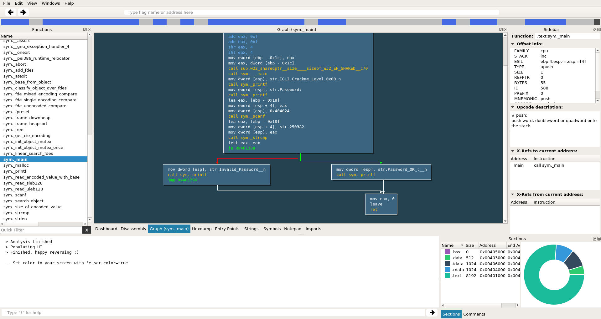

.. _index:

Radare2
=======

.. toctree::
   :hidden:
   :maxdepth: 1

   documentation
   screenshots
   downloads
   community
   merchandise
   scripting
   cutter
   r2con/index
   talks
   tools

Radare is a `LGPL <https://www.gnu.org/copyleft/lesser.html>`__ portable reversing framework that can:

- Disassemble (and assemble for) many different architectures
- Debug natively or use remote targets (gdb, r2pipe, winedbg, windbg)
- Run on Linux, \*BSD, Windows, OSX, Android, iOS, Solaris and Haiku
- Perform forensics on filesystems and data carving
- Be scripted in Python, Javascript, Go and more
- Support collaborative analysis using the embedded webserver
- Visualize data structures of several file types
- Patch programs to uncover new features or fix vulnerabilities
- Use powerful analysis capabilities to speed up reversing
- Aid in software exploitation

.. |writeasm| image:: _static/screenshots/writeasm.png
  :alt: screenshot of radare2
  :target: _images/writeasm.png

.. |typical| image:: _static/screenshots/typical.jpg
  :alt: emulation of mmx/sse
  :target: _images/typical.jpg

+---------------------+---------------------+---------------------+
| | |writeasm|        | | |typical|         | | |cutter|          |
+---------------------+---------------------+---------------------+

You can start by reading its :ref:`documentation <documentation>`,
:ref:`check the community <community>`,
see how it :ref:`compares to others <comparison>`,
get some :ref:`swag <merchandise>` and of course,
:ref:`download it <downloads>`.
