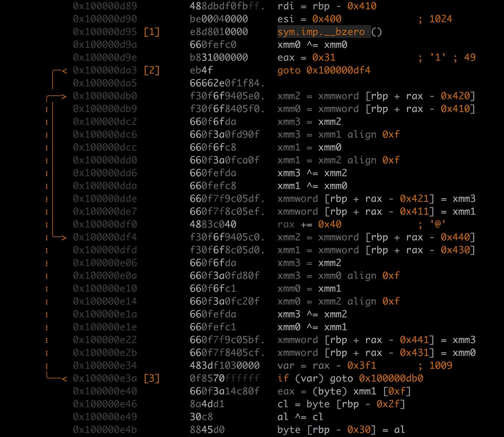
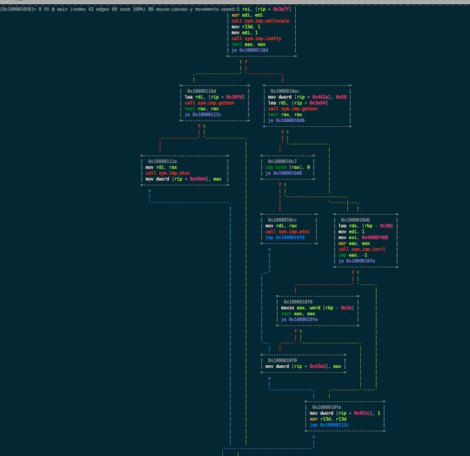

.. _screenshots:

Screenshots
===========

Self-documentation
------------------

.. image:: _static/screenshots/r2help.png
  :alt: radare2 help
  :scale: 100 %
  :align: center

Typical usage
-------------

.. image:: _static/screenshots/typical.jpg
  :alt: typical usage of radare2
  :scale: 50 %
  :align: center

Interactive assembler
---------------------

.. image:: _static/screenshots/writeasm.png
  :alt: radare2 interactive assembler
  :scale: 100 %
  :align: center

MMX/SSE emulation support
-------------------------

ASCII-art graphs
----------------

