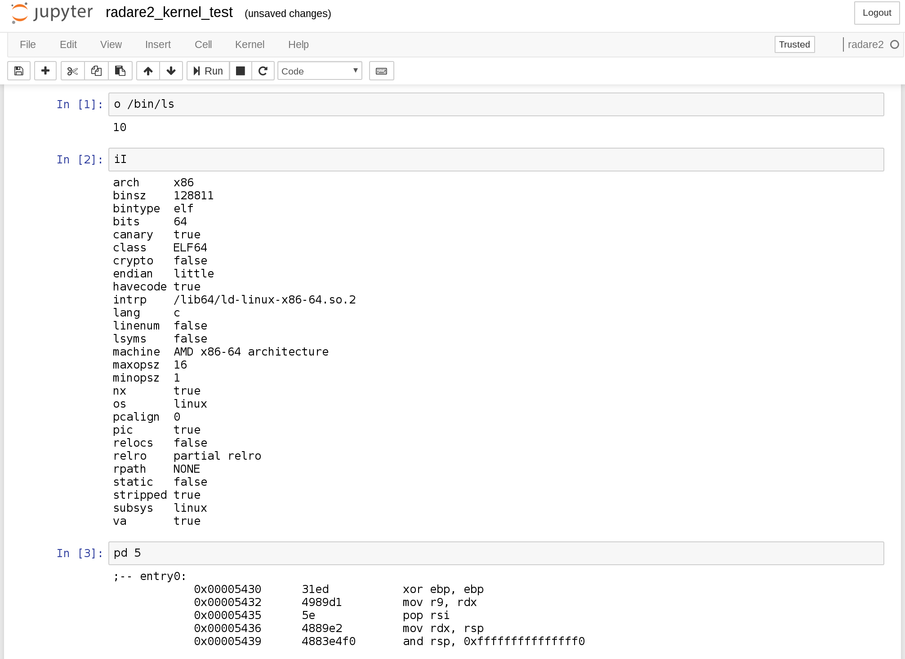

.. _tools:

Tools
=====

Since radare2 is completely extensible, some people have come up with interesting projects
based or around it. Here are, in our opinion, the most significant/advanced/useful ones.

r2frida
-------

Maybe you've heard of the **amazing** `frida <https://www.frida.re/>`_ project,
by `oleavr <https://twitter.com/oleavr>`__,
a dynamic instrumentation toolkit for developers, reverse-engineers, and security researchers,
written in javascript and super easy to use?

Then we have good news: there is `r2frida <https://github.com/nowsecure/r2frida>`__,
a plugin to combine them both! It was presented at the :ref:`r2con 2017 <r2con_2017>`
(you can check the slides `here <https://slides.com/oleavr/r2frida/>`__.

To use it, you can either specify a pid, a process name, or a binary:

::

  $ r2 frida://1234
  $ r2 frida://Twitter
  $ r2 frida://"/bin/ls -al"

This will make radare2 use frida as a backend.

r2 webui
--------

Radare2 comes with a web interface, that can be launched via ``r2 -c=H /bin/ls``,
and it looks like this:

.. image:: _static/webui.png
  :alt: webui screenshot
  :scale: 75 %
  :align: center

If you're too lazy to install it, you can give it a try `here <http://cloud.radare.org/beta/>`__.

jupyter-radare2
---------------

A simple radare2 `Jupyter <https://jupyter.org/>`__ kernel,
by `guedou <https://twitter.com/guedou>`__, that can be used to make
interactive radare2 tutorials, or take advanced notes.
You can get it `here <https://github.com/guedou/jupyter-radare2>`__.

::

  $ jupyter console --kernel radare2
  Jupyter console 5.2.0

  In [1]: o /bin/ls
  9
  In [2]: afl

  In [3]: afl~main

  In [4]: pd 5
  ;-- entry0:
    0x00005430      31ed           xor ebp, ebp
    0x00005432      4989d1         mov r9, rdx
    0x00005435      5e             pop rsi
    0x00005436      4889e2         mov rdx, rsp
    0x00005439      4883e4f0       and rsp, 0xfffffffffffffff0
  In [5]:                                                                                                                                               
  Do you really want to exit ([y]/n)? y
  Shutting down kernel

It looks like this:

acr
---

`acr <https://github.com/radare/acr>`__ stand for *AutoConf Replacement*. It's
a GPLv2 replacement for `autoconf
<https://www.gnu.org/software/autoconf/autoconf.html>`__, based on shell
scripts instead of M4 macros, making it simpler, faster, and easier to use.  It
comes with `extensive documentation
<https://github.com/radare/acr/tree/master/man>`__ and various `examples
<https://github.com/radare/acr/tree/master/examples>`__.

We're using it to generate radare2's Makefiles.

valabind
--------

`valabind <https://github.com/radare/valabind>`__ is a tool to parse `vala
<http://live.gnome.org/Vala>`__ or vapi files to transform them into `swig
<http://www.swig.org/>`__ interface files, C++, NodeJS-ffi or `GIR
<https://wiki.gnome.org/action/show/Projects/GObjectIntrospection?action=show&redirect=GObjectIntrospection>`__.

It's used to generate the (now deprecated) bindings for radare2.

radare2-extras
-------------

`radare2-extras <https://github.com/radare/radare2-extras>`__ contains additional plugins
for radare2. They aren't included in the core for various reasons:
dependency on external libraries, marginal/specific usecase, duplicate features, …

The recommended way to build/install/toy with/… those plugins is to use :ref:`r2pm <r2pm>`.

radare2-bindings
----------------

`radare2-bindings <https://github.com/radare/radare2-bindings>`__ are the bindings for radare2,
generated by *valabind*.
They are being deprecated in favour of :ref:`r2pipe <scripting>`.
